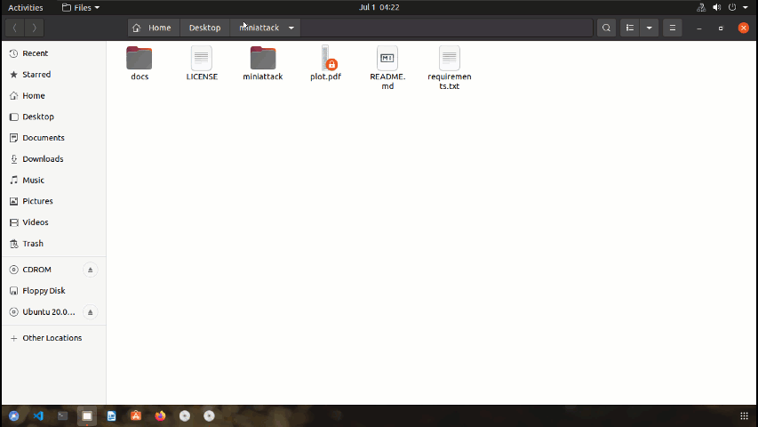

# Miniattack

Simulate Attacks With Mininet And Hping3

It measures network load with `bwm-ng` when the net is under attack and plots the result.



This demo has been tested on `Ubuntu 20` with `Python 3.8`. 

The attack range is highlighted in red color.

View the topology on [Mininet-Topology-Visualizer](http://demo.spear.narmox.com/app/?apiurl=demo#!/mininet?data=%7B%22dump%22%3A%22%3CHost%20h1%3A%20h1-eth0%3A10.0.0.1%20pid%3D29037%3E%20%5Cn%3CHost%20h2%3A%20h2-eth0%3A10.0.0.2%20pid%3D29039%3E%20%5Cn%3CHost%20h3%3A%20h3-eth0%3A10.0.0.3%20pid%3D29041%3E%20%5Cn%3CHost%20h4%3A%20h4-eth0%3A10.0.0.4%20pid%3D29043%3E%20%5Cn%3CHost%20h5%3A%20h5-eth0%3A10.0.0.5%20pid%3D29045%3E%20%5Cn%3CHost%20h6%3A%20h6-eth0%3A10.0.0.6%20pid%3D29047%3E%20%5Cn%3CHost%20h7%3A%20h7-eth0%3A10.0.0.7%20pid%3D29049%3E%20%5Cn%3CHost%20h8%3A%20h8-eth0%3A10.0.0.8%20pid%3D29051%3E%20%5Cn%3COVSSwitch%20s1%3A%20lo%3A127.0.0.1%2Cs1-eth1%3ANone%2Cs1-eth2%3ANone%2Cs1-eth3%3ANone%2Cs1-eth4%3ANone%20pid%3D29056%3E%20%5Cn%3COVSSwitch%20s2%3A%20lo%3A127.0.0.1%2Cs2-eth1%3ANone%2Cs2-eth2%3ANone%2Cs2-eth3%3ANone%2Cs2-eth4%3ANone%20pid%3D29059%3E%20%5Cn%3COVSSwitch%20s3%3A%20lo%3A127.0.0.1%2Cs3-eth1%3ANone%2Cs3-eth2%3ANone%2Cs3-eth3%3ANone%2Cs3-eth4%3ANone%20pid%3D29062%3E%20%5Cn%3COVSSwitch%20s4%3A%20lo%3A127.0.0.1%2Cs4-eth1%3ANone%2Cs4-eth2%3ANone%2Cs4-eth3%3ANone%2Cs4-eth4%3ANone%20pid%3D29065%3E%20%5Cn%3COVSSwitch%20s5%3A%20lo%3A127.0.0.1%2Cs5-eth1%3ANone%2Cs5-eth2%3ANone%2Cs5-eth3%3ANone%2Cs5-eth4%3ANone%20pid%3D29068%3E%20%5Cn%3COVSSwitch%20s6%3A%20lo%3A127.0.0.1%2Cs6-eth1%3ANone%2Cs6-eth2%3ANone%2Cs6-eth3%3ANone%2Cs6-eth4%3ANone%20pid%3D29071%3E%20%5Cn%3COVSSwitch%20s7%3A%20lo%3A127.0.0.1%2Cs7-eth1%3ANone%2Cs7-eth2%3ANone%2Cs7-eth3%3ANone%2Cs7-eth4%3ANone%20pid%3D29074%3E%20%5Cn%3COVSSwitch%20s8%3A%20lo%3A127.0.0.1%2Cs8-eth1%3ANone%2Cs8-eth2%3ANone%2Cs8-eth3%3ANone%2Cs8-eth4%3ANone%20pid%3D29077%3E%20%5Cn%3COVSSwitch%20s9%3A%20lo%3A127.0.0.1%2Cs9-eth1%3ANone%2Cs9-eth2%3ANone%2Cs9-eth3%3ANone%2Cs9-eth4%3ANone%20pid%3D29080%3E%20%5Cn%3COVSSwitch%20s10%3A%20lo%3A127.0.0.1%2Cs10-eth1%3ANone%2Cs10-eth2%3ANone%2Cs10-eth3%3ANone%2Cs10-eth4%3ANone%20pid%3D29083%3E%20%5Cn%3CController%20c0%3A%20127.0.0.1%3A6653%20pid%3D29030%3E%22%2C%22links%22%3A%22h1-eth0%3C-%3Es1-eth1%20(OK%20OK)%20%5Cnh2-eth0%3C-%3Es1-eth2%20(OK%20OK)%20%5Cnh3-eth0%3C-%3Es2-eth1%20(OK%20OK)%20%5Cnh4-eth0%3C-%3Es2-eth2%20(OK%20OK)%20%5Cnh5-eth0%3C-%3Es3-eth1%20(OK%20OK)%20%5Cnh6-eth0%3C-%3Es3-eth2%20(OK%20OK)%20%5Cnh7-eth0%3C-%3Es4-eth1%20(OK%20OK)%20%5Cnh8-eth0%3C-%3Es4-eth2%20(OK%20OK)%20%5Cns1-eth3%3C-%3Es5-eth1%20(OK%20OK)%20%5Cns1-eth4%3C-%3Es6-eth1%20(OK%20OK)%20%5Cns2-eth4%3C-%3Es5-eth2%20(OK%20OK)%20%5Cns2-eth3%3C-%3Es6-eth2%20(OK%20OK)%20%5Cns3-eth3%3C-%3Es7-eth1%20(OK%20OK)%20%5Cns3-eth4%3C-%3Es8-eth1%20(OK%20OK)%20%5Cns4-eth4%3C-%3Es7-eth2%20(OK%20OK)%20%5Cns4-eth3%3C-%3Es8-eth2%20(OK%20OK)%20%5Cns5-eth3%3C-%3Es9-eth1%20(OK%20OK)%20%5Cns5-eth4%3C-%3Es10-eth1%20(OK%20OK)%20%5Cns6-eth3%3C-%3Es9-eth2%20(OK%20OK)%20%5Cns6-eth4%3C-%3Es10-eth2%20(OK%20OK)%20%5Cns7-eth3%3C-%3Es9-eth3%20(OK%20OK)%20%5Cns7-eth4%3C-%3Es10-eth3%20(OK%20OK)%20%5Cns8-eth3%3C-%3Es9-eth4%20(OK%20OK)%20%5Cns8-eth4%3C-%3Es10-eth4%20(OK%20OK)%22%2C%22positions%22%3A%22%7B%5C%22objects%5C%22%3A%5B%7B%5C%22type%5C%22%3A%5C%22switch%5C%22%2C%5C%22id%5C%22%3A%5C%22s1%5C%22%2C%5C%22x%5C%22%3A-118.73140130536854%2C%5C%22y%5C%22%3A221.26629968384344%7D%2C%7B%5C%22type%5C%22%3A%5C%22switch%5C%22%2C%5C%22id%5C%22%3A%5C%22s2%5C%22%2C%5C%22x%5C%22%3A56.388501053877235%2C%5C%22y%5C%22%3A221.27949853657918%7D%2C%7B%5C%22type%5C%22%3A%5C%22switch%5C%22%2C%5C%22id%5C%22%3A%5C%22s3%5C%22%2C%5C%22x%5C%22%3A265.41809477535026%2C%5C%22y%5C%22%3A222.1676058496177%7D%2C%7B%5C%22type%5C%22%3A%5C%22switch%5C%22%2C%5C%22id%5C%22%3A%5C%22s4%5C%22%2C%5C%22x%5C%22%3A465.4056160659434%2C%5C%22y%5C%22%3A221.88560816475155%7D%2C%7B%5C%22type%5C%22%3A%5C%22switch%5C%22%2C%5C%22id%5C%22%3A%5C%22s5%5C%22%2C%5C%22x%5C%22%3A-118.08230003837195%2C%5C%22y%5C%22%3A100.62729794721747%7D%2C%7B%5C%22type%5C%22%3A%5C%22switch%5C%22%2C%5C%22id%5C%22%3A%5C%22s6%5C%22%2C%5C%22x%5C%22%3A50.740002434551684%2C%5C%22y%5C%22%3A98.1864028302789%7D%2C%7B%5C%22type%5C%22%3A%5C%22switch%5C%22%2C%5C%22id%5C%22%3A%5C%22s7%5C%22%2C%5C%22x%5C%22%3A264.2184182438018%2C%5C%22y%5C%22%3A105.75010075792818%7D%2C%7B%5C%22type%5C%22%3A%5C%22switch%5C%22%2C%5C%22id%5C%22%3A%5C%22s8%5C%22%2C%5C%22x%5C%22%3A463.0250923488302%2C%5C%22y%5C%22%3A109.09860392061768%7D%2C%7B%5C%22type%5C%22%3A%5C%22switch%5C%22%2C%5C%22id%5C%22%3A%5C%22s9%5C%22%2C%5C%22x%5C%22%3A-36.6969991430193%2C%5C%22y%5C%22%3A-26.542601027229466%7D%2C%7B%5C%22type%5C%22%3A%5C%22switch%5C%22%2C%5C%22id%5C%22%3A%5C%22s10%5C%22%2C%5C%22x%5C%22%3A357.8463188088881%2C%5C%22y%5C%22%3A-24.73690069819844%7D%2C%7B%5C%22type%5C%22%3A%5C%22server%5C%22%2C%5C%22id%5C%22%3A%5C%22h1%5C%22%2C%5C%22x%5C%22%3A-150.14686599564223%2C%5C%22y%5C%22%3A329.5646106237859%7D%2C%7B%5C%22type%5C%22%3A%5C%22server%5C%22%2C%5C%22id%5C%22%3A%5C%22h2%5C%22%2C%5C%22x%5C%22%3A-62.282358918536744%2C%5C%22y%5C%22%3A328.7932177900256%7D%2C%7B%5C%22type%5C%22%3A%5C%22server%5C%22%2C%5C%22id%5C%22%3A%5C%22h3%5C%22%2C%5C%22x%5C%22%3A35.03174088971062%2C%5C%22y%5C%22%3A331.4581043043449%7D%2C%7B%5C%22type%5C%22%3A%5C%22server%5C%22%2C%5C%22id%5C%22%3A%5C%22h4%5C%22%2C%5C%22x%5C%22%3A116.02394485537755%2C%5C%22y%5C%22%3A330.68680302332046%7D%2C%7B%5C%22type%5C%22%3A%5C%22server%5C%22%2C%5C%22id%5C%22%3A%5C%22h5%5C%22%2C%5C%22x%5C%22%3A244.26344871941993%2C%5C%22y%5C%22%3A330.77451054415855%7D%2C%7B%5C%22type%5C%22%3A%5C%22server%5C%22%2C%5C%22id%5C%22%3A%5C%22h6%5C%22%2C%5C%22x%5C%22%3A325.25563742629765%2C%5C%22y%5C%22%3A330.00311771039827%7D%2C%7B%5C%22type%5C%22%3A%5C%22server%5C%22%2C%5C%22id%5C%22%3A%5C%22h7%5C%22%2C%5C%22x%5C%22%3A442.3276606551817%2C%5C%22y%5C%22%3A324.0775194775687%7D%2C%7B%5C%22type%5C%22%3A%5C%22server%5C%22%2C%5C%22id%5C%22%3A%5C%22h8%5C%22%2C%5C%22x%5C%22%3A531.0512642721883%2C%5C%22y%5C%22%3A323.3062181965442%7D%5D%7D%22%7D)

### Usage
```
sudo python3 miniattack <option-1> <option-2> <interfaces>
```
For the options, you can set any supported options of `hping3`. See `hping3 -h` for more information.

After setting options, you can declare the name of the interfaces which want to be displayed. If no interface is declared, all of them will be displayed.

#### Sample 1:
```
sudo python3 miniattack --flood --udp
```

#### Sample 2:
```
sudo python3 miniattack --flood --udp s1-eth1 s1-eth2
```

Every time the program runs, the resulting plot will be saved as pdf with the name `plot.pdf` in the same directory.

## Author
**Rabist** - view on [LinkedIn](https://www.linkedin.com/in/rabist)

## Details
- **Course:** Internet Engineering - Undergraduate
- **Teacher:** [Dr. Mehran Shetabi](https://yazd.ac.ir/en/people/shetabi)
- **Univ:** Yazd University
- **Semester:** Spring 1400

## License
Licensed under [MIT](LICENSE).
